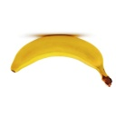
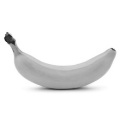
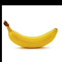

# Data Augmentation

Small data augmentation module. Test code can be found in data_augmentation.py and in main you can find a small usage example.
Examples:  
### Original:  
  
### Flipped:  
  
### Grayscale:  
  
### Shifted:  
  

## Operations

Currently the module supports the following opperations:

* Image grayscaling
* Image flipping
* Image rotation
* Image shifting
* Adding image noise (Gaussian)
* Image blurring

## Requirements
* numpy
* scipy
* opencv-python

